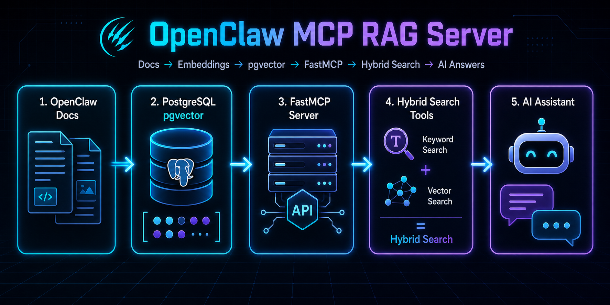

<!-- ====== HEADER / BANNER ====== -->
<div align="center">


# 📖 OpenClaw Docs MCP

### `< Hybrid Search />` &nbsp;•&nbsp; pgvector &nbsp;•&nbsp; 🤖 FastMCP


</div>

---

## 🚀 What is this?

```python
class OpenClawDocsMCP(FastMCP):
    def __init__(self):
        self.name        = "OpenClaw Docs MCP"
        self.purpose     = "RAG server for OpenClaw documentation"
        self.stack       = ["Python", "FastMCP", "PostgreSQL", "pgvector"]
        self.superpower  = "Hybrid search (semantic + full-text) across English docs"

    def features(self):
        return [
            "Indexes docs into PostgreSQL",
            "Exposes 13 MCP search tools via HTTP",
            "Incremental sync via content hash"
        ]
```

This is an **MCP RAG server** tailored for the [OpenClaw documentation](https://docs.openclaw.ai). It indexes English documentation pages into PostgreSQL using **pgvector** and exposes hybrid search tools via **HTTP** using [FastMCP](https://gofastmcp.com).

## ✨ Features
- 🔍 **Hybrid Search:** Combines semantic (pgvector) and full-text search across ~721 English documentation pages.
- 🧰 **13 MCP Tools:** Fully equipped with search, get_chunk, navigation (next/prev), page outlines, and index statistics.
- 🔌 **HTTP Transport:** Exposed over HTTP with API key authentication for secure access.
- 🔄 **Incremental Sync:** Smart syncing via content hashing (no redundant updates).
- 🛠️ **System Integration:** Ready for production with a `systemd` service and optional daily sync timer.

## 🛠️ Tech Stack
<table align="center"> 
  <tr> 
    <td align="center" width="120"> 
      <br><b>Python 3.11+</b> 
    </td> 
    <td align="center" width="120"> 
      <br><b>PostgreSQL 15+</b> 
    </td> 
    <td align="center" width="120"> 
      <br><b>pgvector</b> 
    </td> 
    <td align="center" width="120"> 
      <br><b>OpenAI API</b> 
    </td> 
  </tr> 
</table>

## 📋 Requirements

- **Python:** `3.11+`
- **Database:** `PostgreSQL 15+` with the [pgvector](https://github.com/pgvector/pgvector) extension installed.
- **AI Access:** OpenAI API key (for embedding generation using `text-embedding-3-small`).

---

## ⚙️ Setup & Installation

**1. Clone and Setup Environment**
```bash
python3 -m venv .venv
source .venv/bin/activate
pip install -e ".[dev]"
```

**2. Configure Environment Variables**
```bash
cp config.env.example config.env
# Edit config.env and fill in: DATABASE_URL, OPENAI_API_KEY, API_KEY
```

**3. Initialize Database & Run Migrations**
```bash
# Create an empty database in PostgreSQL, then run:
alembic upgrade head
```

**4. Index the Documentation**
```bash
# Crawls the sitemap and indexes content (~5-15 min)
openclaw-docs-mcp ingest --full
```

**5. Start the MCP Server**
```bash
openclaw-docs-mcp serve
```
> The server runs at `http://0.0.0.0:8000/mcp` (configurable via `MCP_PORT` in `config.env`).

---

## 🧰 MCP Tools Available

> ⚠️ **Note:** Write all queries in **English** for the best results (docs are indexed in English only).

| Tool | Description |
|------|-------------|
| `search` | Hybrid semantic + full-text search |
| `search_in_page` | Search within a single document |
| `lexical_search` | Full-text search only |
| `get_chunk` | Full chunk by ID |
| `get_chunks` | Batch retrieve chunks |
| `get_chunk_next` / `get_chunk_prev` | Navigate document order |
| `get_chunk_neighbors` | Previous + current + next |
| `get_context_window` | Symmetric context around a chunk |
| `get_document_chunks` | Paginate chunks in a document |
| `list_pages` | List indexed pages |
| `get_page_outline` | Headings + chunk IDs |
| `get_stats` | Index statistics |

---

## 🔌 Cursor Configuration

To use this MCP server with Cursor, add it to your configuration:

### 🏠 Localhost (same machine)

```json
{
  "mcpServers": {
    "openclaw-docs": {
      "url": "http://127.0.0.1:8000/mcp",
      "headers": {
        "Authorization": "YOUR_API_KEY"
      }
    }
  }
}
```

### 🌍 Remote (e.g., via Cloudflare tunnel)

```json
{
  "mcpServers": {
    "openclaw-docs": {
      "command": "npx",
      "args": [
        "-y", "mcp-remote@latest",
        "https://your-tunnel.example.com/mcp",
        "--header", "Authorization: Bearer ${OPENCLAW_DOCS_API_KEY}"
      ],
      "env": {
        "OPENCLAW_DOCS_API_KEY": "YOUR_API_KEY"
      }
    }
  }
}
```

---

## 🚀 systemd Deployment

For a robust production setup, use `systemd` to manage the server and automatic syncs:

```bash
sudo cp deploy/openclaw-docs-mcp.service /etc/systemd/system/
sudo cp deploy/openclaw-docs-mcp-sync.service deploy/openclaw-docs-mcp-sync.timer /etc/systemd/system/
sudo cp deploy/sync-wrapper.sh /home/miguelcc06/openclaw-docs-mcp/deploy/
chmod +x deploy/sync-wrapper.sh

sudo systemctl daemon-reload
sudo systemctl enable --now openclaw-docs-mcp
sudo systemctl enable --now openclaw-docs-mcp-sync.timer
```

> **Tip:** Set `SYNC_ENABLED=true` and `SYNC_SCHEDULE=daily` in `config.env`.

---

## 💻 CLI Commands Quick Reference

```bash
openclaw-docs-mcp serve          # Start HTTP MCP server
openclaw-docs-mcp ingest --full  # Full re-index
openclaw-docs-mcp sync           # Incremental sync
openclaw-docs-mcp stats          # Index statistics
alembic upgrade head             # Apply DB migrations
```

---

<div align="center">
  <b>License: MIT</b><br>
  <i>Built to make AI smarter about its own documentation.</i>
</div>
